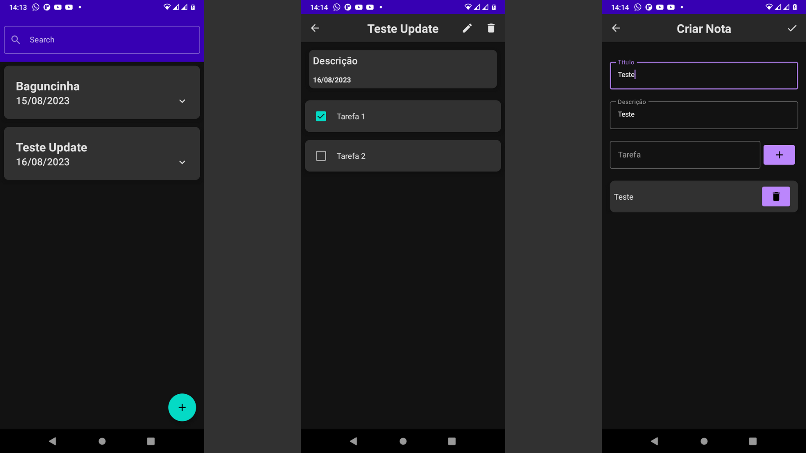

# Momo Notes

## Sobre o Projeto
Projeto criado para desenvolver melhor minhas habilidades em desenvolvimento android refazendo um
aplicativo que uso de notas usando Jetpack Compose com a arquitetura MVVM, utilizando técnicas como
State Holders e ViewModels.

## Tecnologias Utilizadas
### Mobile
- Room Database
- Dagger
- Jetpack Compose
- Navigation

# Layout Mobile
