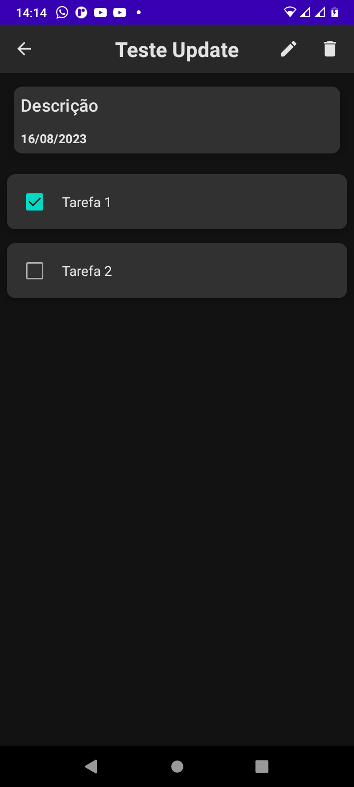
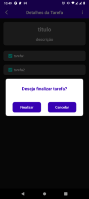

# Projeto Ricky Notas

# Sobre o Projeto
Projeto pessoal para gerenciamento de demandas, onde basicamente é um CRUD usando kotlin e roomdatabase com coroutines para o gerenciamento de thread para as operações na database.

# Layout Mobile
## Tela inicial

## Criação de Tarefa

## Tela Inicial com a nova demanda

## Detalhes da demanda

## Se deseja finalizar da tarefa

## Menu para edição da tarefa ou exclusão

## Se deseja excluir a tarefa
